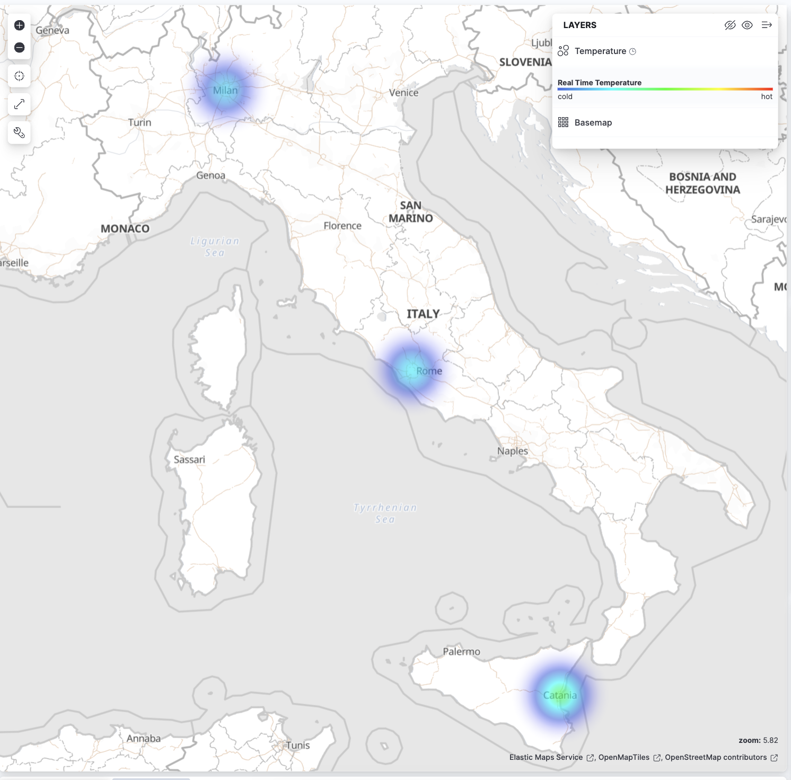
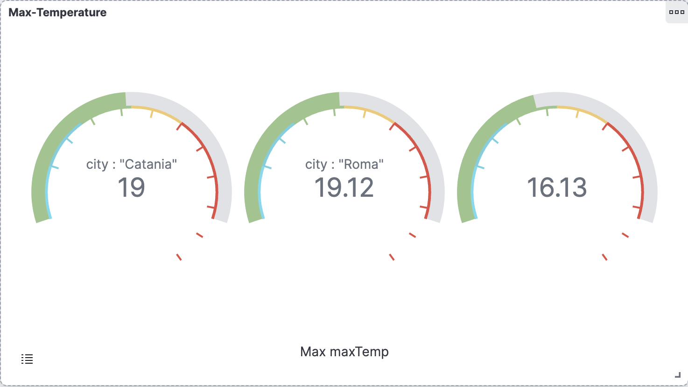
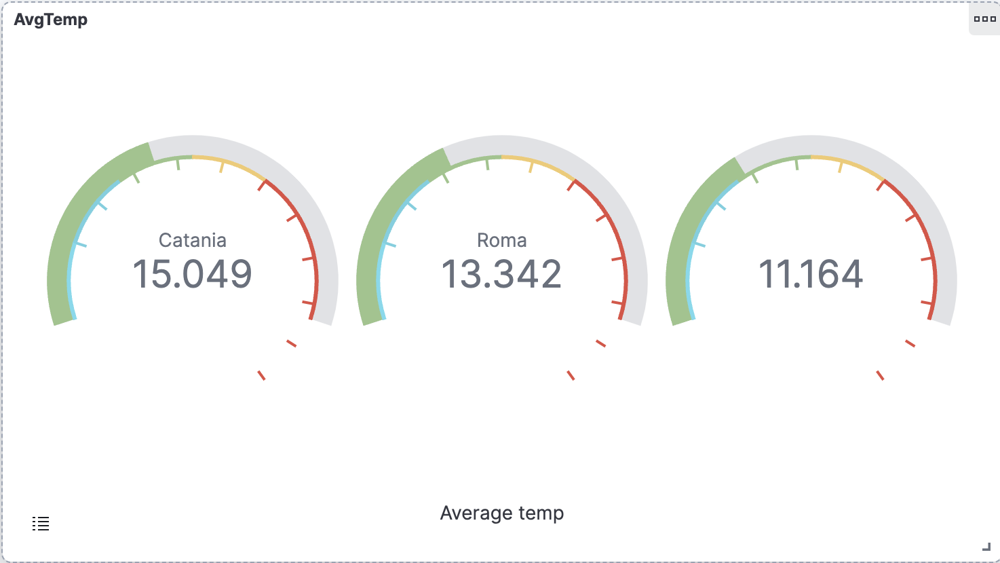
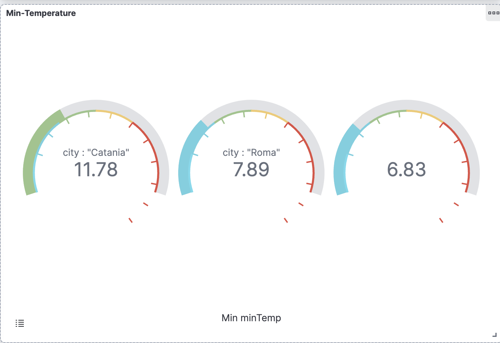
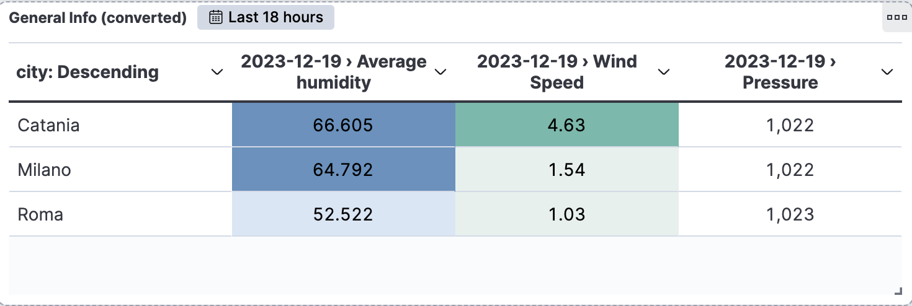
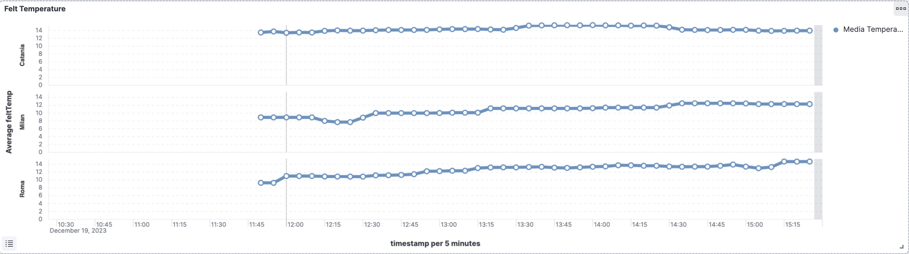
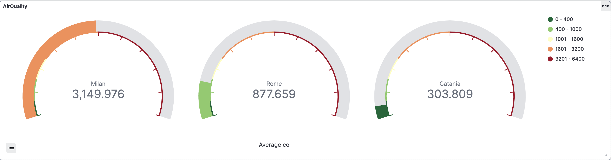
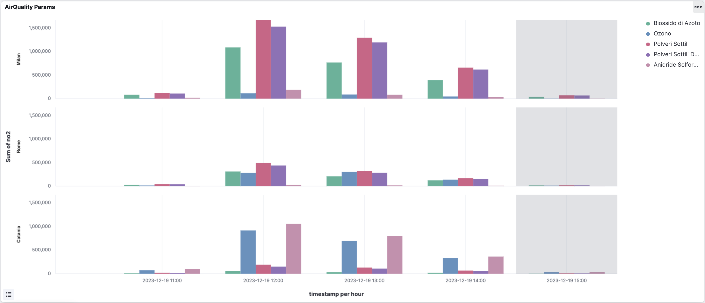
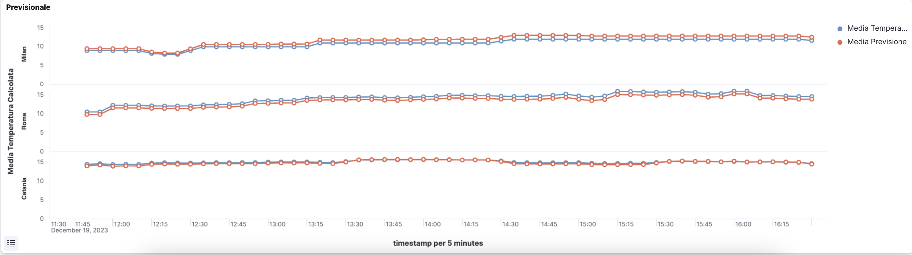

# Weather Wizard
  

       


The WeatherWizard is a project based on different technologies and frameworks and it allows to definition of a pipeline for the processing of data, coming from different sources and in real-time.

The goal of the project is the monitor and show the streaming real-time data of weather conditions of 3 Italian cities: Catania, Roma, and Milano. The data pipeline starts its function by doing polling action to 3 APIs: WeatherAPI, OpenWeatherAPI, and TomorrowAPI. Before the communication, the WeatherWizard module sends a request to obtain a token to authenticate the client for the next requests.

Obtained the token, the next request to APIs will have the token inside it and these will reply with weather data. These data will be sent to fluent that match the information received and dispatch these, through the configuration file, to 3 Kafka topics: Catania, Roma, and Milano. Each topic is linked to the KafkaStreamModule service that receives weather data and sends it to the other 3 Kafka topics: WeatherCT, WeatherRM, and WeatherMI.

Finally, the SparkStreamingModule service takes care of taking information from Kafka topics, mapping them, connecting to elasticsearch, creating a 'weather_wizard' index, and displaying them on Kibana.


# API Reference
Following will be shown all API References used within this project.

### WeatherAPI
To fetch weather data from WeatherAPI.

```http
  GET http://api.weatherapi.com/v1
```

| Parameter | Type     | Description                |
| :-------- | :------- | :------------------------- |
| `lang` | `string` | <**Optional**> Returns data field in API in the desired language  |
| `aqi` | `string` | <**Optional**> Enable/Disable Air Quality data in forecast API output  |
| `key` | `string` | <**Required**> API Key  |
| `q` | `string` | <**Required**> City name  |

### TomorrowAPI
To fetch geo-location and weather data from TomorrowAPI.

```http
  GET http://api.openweathermap.org/geo/1.0/direct
```

```http
  GET https://api.openweathermap.org/data/2.5/weather
```

| Parameter | Type     | Description                       |
| :-------- | :------- | :-------------------------------- |
| `apikey`  | `string` | <**Required**> API Key            |
| `location`| `string` | <**Required**> City name          |


### OpenWeatherAPI
To fetch weather data from OpenWeatherAPI.

| Parameter | Type     | Description                        |
| :-------- | :------- | :--------------------------------- |
| `lat`     | `string` | <**Required**> Latitude            |
| `lon`    | `string` | <**Required**> Longitude            |
| `appid`   | `string` | <**Required**> API Key             |
| `units`   | `string` | <**Optional**> Units of measurement|
| `lang`    | `string` | <**Optional**> Language of received data|

### Local Controllers
API requests to enable/disable the project services

#### WeatherWizard
```http
  PUT http://localhost:8080/v0/polling/activate
```

```http
  PUT http://localhost:8080/v0/polling/disable
```
To disable the polling service.

#### SparkStreamingModule
```http
  POST http://localhost:8084/v0/spark/start
```

```http
  POST http://localhost:8084/v0/spark/stop
```
---
## Demo
The following images is an example of the execution of the project that, shows the weather data, with kibana, for the date: 19/12/2023
The data are elaborated in real time, then, at the end of the day, it can have a little change of values.

This Image shows the heat map values for the real-time temperature inside the three cities: Catania, Milano, and Roma:




The following images indicates the Max, Avg and Min temperature calculated:





Has been monitored also the pressure, humidity and the wind speed for each cities:




Following graph shows the histogram felt temperature: 


Also, has been monitored tha air quality for each of cities:





<br>

<br>
<br>

<br>


The following graph shows the next average value, calculated with machine learning libraries of the Temperature field, based on the last felt temperature value. 
All of this, with the interval of 15 minutes.



---
## Author

- [Salvatore Piemonte](https://github.com/GingermanSP7)

